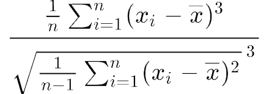
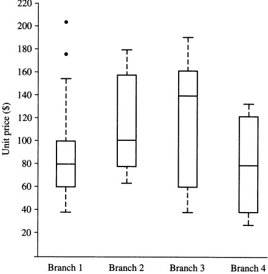

# Question 1

## Business Intelligence Definition

An umbrella term which combines architectures, tools, databases, analytical tools, applications, and methodologies that are to enable interactive access (sometimes in real time) to data, to enable manipulation of data, and to give business managers and analysts the ability to conduct appropriate analyses

## Business Intelligence Legal Risks

Sometimes using tools in business intelligence may have legal risks. For instance, if a business intelligence researcher use a web crawler to fetch sensitive data from a company's website, it may infringe the intellectual property right of the company.

### Case & Discussion

In 2015, 3 employees in Yuan Guang Company used web crawler tools to illegally acquire the sensitive data stored in web servers of Gu Mi Technology Cooperation. In 2018, Gu Mi Technology Cooperation took Yuan Guang Company to court. Finally, Gu Mi Technology Cooperation won the lawsuit and the court sentenced Yuan Guang Company to compensate Gu Mi Technology Cooperation 500000 yuan.

From this case, we can see that using business intelligence tools to fetch sensitive data may violate laws. We should be careful when using those tools and only use them in legal circumstances.

# Question 2

# Skewness Definition

For a sample of n values, the sample skewness S is a measure of the asymmetry of the distribution of samples. Negative skewness commonly indicates that the tail is on the left side of the distribution, and positive skew indicates that the tail is on the right. A zero value means that the tails on both sides of the mean balance out overall; this is the case for a symmetric distribution, but can also be true for an asymmetric distribution where one tail is long and thin, and the other is short but fat.

The skewness formula is as follows:



# Examples

## Symmetric

### Data Set

| Samples |
| -- |
| 10, 15, 15, 20, 20, 20, 25, 25, 30 |

### Solution

(Sample mean) m = 20

numerator = \[(10-m)<sup>3</sup>+2*(15-m)<sup>3</sup>+3*(20-m)<sup>3</sup>+2*(25-m)<sup>3</sup>+(30-m)<sup>3</sup>\] / 9 = (-1000-250+0+250+1000) / 9 = 0

denominator = {\[(10-m)<sup>2</sup>+2*(15-m)<sup>2</sup>+3*(20-m)<sup>2</sup>+2*(25-m)<sup>2</sup>+(30-m)<sup>2</sup>\] / (9-1)}<sup>1/3</sup> = \[(100+50+0+50+100)/8\]<sup>1/3</sup> = 3.347

(Skewness) S = numerator / denominator = 0 / 3.347 = 0

## Positively Skewed

### Data Set

| Samples |
| -- |
| 10, 10, 15, 15, 15, 20, 20, 25 |

### Solution

(Sample mean) m = (2\*10+3\*15+2\*20+25)/8 = 16.25

numerator = \[2*(10-m)<sup>3</sup>+3*(15-m)<sup>3</sup>+2*(20-m)<sup>3</sup>+(25-m)<sup>3</sup>\] / 8 = 35.16

denominator = {\[2*(10-m)<sup>2</sup>+3*(15-m)<sup>2</sup>+2*(20-m)<sup>2</sup>+(25-m)<sup>2</sup>\] / (8-1)}<sup>1/3</sup> = 2.99

(Skewness) S = numerator / denominator = 35.16 / 2.99 = 11.76 > 0

## Negatively Skewed

### Data Set

| Samples |
| -- |
| 15, 20, 20, 25, 25, 25, 30, 30 |

### Solution

(Sample mean) m = (15+2\*20+3\*25+2\*30)/8 = 23.75

numerator = \[(15-m)<sup>3</sup>+2*(20-m)<sup>3</sup>+3*(25-m)<sup>3</sup>+2*(30-m)<sup>3</sup>\] / 8 = -35.16

denominator = {\[(15-m)<sup>2</sup>+2*(20-m)<sup>2</sup>+3*(25-m)<sup>2</sup>+2*(30-m)<sup>2</sup>\] / (8-1)}<sup>1/3</sup> = 2.99

(Skewness) S = numerator / denominator = -35.16 / 2.99 = -11.76 < 0

# Question 3

See question3.xlsx

# Question 4

For this box plot:



It plots for unit price data of items sold at four branches of AllElectronics during a given time period. Here we assume that all branches sold equal number of goods (we can set it to 5, for simplicity) and the cost of the goods are the same (we can set it to 0, for simplicity).

For 1st branch:

Relative Benefit = 40+60+80+100+155 = 435

For 2nd branch:

Relative Benefit = 62+80+100+158+180 = 580

For 3rd branch:

Relative Benefit = 40+60+140+160+190 = 590

For 4th branch:

Relative Benefit = 30+40+80+120+130 = 400

So, branch 3 has the best benefit, since 590 > 580 > 435 > 400

# Question 5

## Data Set

| Object ID | prop1 (nominal) | prop2 (binary) | prop3 (binary) | prop4 (binary) | prop5 (numeric) | prop6 (numeric) | prop7 (ordinal) |
| -- | -- | -- | -- | -- | -- | -- | -- |
| 1 | A | Y | N | Y | 1.5 | 2.3 | excellent |
| 2 | B | Y | N | N | 0.8 | 2.1 | fair |
| 3 | A | Y | Y | Y | 1.2 | 1.7 | good |

(binary properties (attributes) are all asymmetric)

# Dissimilarity Matrix

For prop5 (numeric)
For prop7 (ordinal): excellent = 1.0, good = 0.5, fair = 0

d(1, 2) = d<sub>nominal</sub> + d<sub>binary</sub> + d<sub>numeric</sub> + d<sub>ordinal</sub> = (1) + (0+1) + 

# Question 6

## Aprioi Algorithm

### Description

Apriori is an algorithm for frequent item set mining and association rule learning over relational databases. It proceeds by identifying the frequent individual items in the database and extending them to larger and larger item sets as long as those item sets appear sufficiently often in the database. The frequent item sets determined by Apriori can be used to determine association rules which highlight general trends in the database: this has applications in domains such as market basket analysis. [1]

Apriori is an algorithm for mining frequent itemsets for Boolean association rules. It uses the Apriori property: all nonempty subsets of a frequent itemset must also be frequent, since A∪B pattern can not occur more frequently than A. Apriori property belongs to a special category of properties called antimonotonicity in the sense that if a set cannot pass a test, all of its supersets will fail the same test as well. Apriori property is used to reduce the search space to improve the efficiency of the level‐wise generation of frequent itemsets.

Apriori algorithm uses prior knowledge of frequent itemset properties and employs an iterative approach known as a level‐wise search, where k‐itemsets are used to explore (k+1)‐itemsets. First, the set of frequent 1‐itemsets is found and denoted by L1; then use L1 to find L2, the set of frequent 2‐itemsets, which is used to find L3, and so on, until no more frequent k‐itemsets can be found. The finding of each Lk requires one full scan of the database.

Apriori algorithm consists of **join** and **prune** actions. The join step: To find Lk, a set of candidate k‐itemsets is generated by joining with Lk‐1 itself. This set of candidates is denoted Ck. The two elements L1 and L2 in Lk‐1 are joinable if: l1[1]=l2[1]) & (l1[2]=l2[2]) & ... & (l1[k-2]=l2[k-2]) & (l1[k-1] less than l2[k-1]).

Ck is the superset of Lk, that is, its members may or may not be frequent, but all of the frequent k‐itemsets are included in Ck. Thus a database scan to determine the count of each candidate in Ck would result in the determination of Lk. To reduce the size of Ck, the Apriori property is used, that is, if any (k‐1)‐subset of a candidate k‐itemset is not in Lk‐1, then the candidate cannot be frequent either and so can be removed from Ck.

### Pseudocode

```
let minimum_support_count = <user_input>;
let minimum_confidence = <user_input>;
let C[] = { <all_1-itemsets> };
let frequent_itemsets[] = {};

do {
    scan database, calculate support_count of each itemset in C;
    foreach(itemset in C) {
        if(itemset.support_count < minimum_support_count) {
            remove itemset from C;
        }
    }
    frequent_itemsets += C;
    
    C = C join C;
    use Apriori property to prune C;
} while(C is not empty);

foreach(itemset in frequent_itemsets) {
    foreach(s in non-empty_subsets(itemset)) {
        if(itemset.support_count / s.support_count >= minimum_confidence) {
            output the rule: s => (itemset - s);
        }
    }
}
```

### Implementation

```
package zck.aprioi;

import java.io.BufferedReader;
import java.io.FileNotFoundException;
import java.io.FileReader;
import java.io.IOException;
import java.util.ArrayList;
import java.util.Comparator;
import java.util.HashMap;
import java.util.Iterator;
import java.util.Scanner;

public class AprioiZckSampleApp {
    private static class ItemSet{
        public ItemSet(Integer supCnt) {
            this.supCnt = supCnt;
        }
        public ArrayList<String> items = new ArrayList<String>();
        public Integer supCnt;
        public String getItemsRepr() {
            StringBuilder sb = new StringBuilder();
            sb.append("{");
            for(int i = 0; i < items.size(); i++) {
                sb.append(items.get(i));
                if(i != items.size()-1) {
                    sb.append(", ");
                }
            }
            sb.append("}");
            return sb.toString();
        }
    }
    private static ArrayList<ItemSet> selfJoin(ArrayList<ItemSet> x){
        ArrayList<ItemSet> result = new ArrayList<ItemSet>();
        for(int i = 0; i < x.size(); i++) {
            ItemSet a = x.get(i);
            for(int j = i+1; j < x.size(); j++) {
                ItemSet b = x.get(j);
                boolean ok = true;
                // a.items & b.items are ordered. (this can be proved by induction)
                for(int k = 0; k < a.items.size()-1; k++) {
                    if(a.items.get(k) != b.items.get(k)) {
                        ok = false;
                        break;
                    }
                }
                if(ok) {
                    // itemset support count cannot be determined yet.
                    ItemSet newItemSet = new ItemSet(0);
                    for(int k = 0; k < a.items.size(); k++) {
                        newItemSet.items.add(a.items.get(k));
                    }
                    newItemSet.items.add(b.items.get(b.items.size()-1));
                    result.add(newItemSet);
                }
            }
        }
        return result;
    }
    private static ArrayList<ItemSet> prune(ArrayList<ItemSet> C1, ArrayList<ItemSet> C) {
        ArrayList<ItemSet> result = new ArrayList<ItemSet>();
        for(ItemSet s : C1) {
            boolean ok = true;
            for(int ms = 0; ms < s.items.size(); ms++) {
                int c1j = 0, ci = 0, cj = 0;
                if(ms == c1j) {
                    ms++;
                }
                while(true) {
                    if(cj >= C.get(ci).items.size()) {
                        // find an itemset in C
                        break;
                    }
                    if(ci >= C.size()) {
                        // cannot find an itemset in C
                        ok = false;
                        break;
                    }
                    int comp = s.items.get(c1j).compareTo(C.get(ci).items.get(cj));
                    if(comp == 0) {
                        // test next item
                        c1j++; cj++;
                        continue;
                    } else if(comp < 0) {
                        // cannot find an itemset in C
                        ok = false;
                        break;
                    } else {
                        // test next itemset
                        ci++;
                        continue;
                    }
                }
                if(!ok) {
                    // cannot find an itemset in C corresponding to {itemset s in C1 dropping item at position *ms*}
                    break;
                }
            }
            if(ok) {
                // find an itemset in C corresponding to {itemset s in C1 dropping item at position *ms*}
                result.add(s);
            }
        }
        return result;
    }
    private static boolean aprioi(String dataFilePath, int minSupCnt, double minConfThr) {
        BufferedReader br;
        ArrayList<ItemSet> C = new ArrayList<ItemSet>();
        ArrayList<ItemSet> freqItemSets = new ArrayList<ItemSet>();
        ArrayList<ArrayList<String>> dataCache = new ArrayList<>();
        ArrayList<String> itemsCache = new ArrayList<>();
        try{
            br = new BufferedReader(new FileReader(dataFilePath));
            String line;
            br.readLine();
            HashMap<String, Integer> m = new HashMap<String, Integer>();
            while((line = br.readLine()) != null) {
                String[] tokens = line.split(" |, ");
                ArrayList<String> dataRow = new ArrayList<>();
                for(int i = 1; i < tokens.length; i++) {
                    if(m.get(tokens[i]) == null) {
                        m.put(tokens[i], 1);
                    } else {
                        m.put(tokens[i], m.get(tokens[i])+1);
                    }
                    dataRow.add(tokens[i]);
                }
                dataRow.sort(new Comparator<String>() {
                    @Override
                    public int compare(String o1, String o2) {
                        return o1.compareTo(o2);
                    }
                });
                dataCache.add(dataRow);
            }
            Iterator<String> it = m.keySet().iterator();
            while(it.hasNext()){
                String k = it.next();
                Integer v = m.get(k);
                itemsCache.add(k);
                if(v >= minSupCnt) {
                    ItemSet s = new ItemSet(v);
                    s.items.add(k);
                    C.add(s);
                }
            }
            // this makes sure that for any ItemSet, its items property is always ordered.
            C.sort(new Comparator<ItemSet>() {
                @Override
                public int compare(ItemSet o1, ItemSet o2) {
                    return o1.items.get(0).compareTo(o2.items.get(0));
                }
            });
            itemsCache.sort(new Comparator<String>() {
                @Override
                public int compare(String o1, String o2) {
                    return o1.compareTo(o2);
                }
            });
            br.close();
        } catch(FileNotFoundException e) {
            e.printStackTrace();
            return false;
        } catch(IOException e){
            e.printStackTrace();
            return false;
        }
        while(true) {
            freqItemSets.addAll(C);
            ArrayList<ItemSet> C1 = selfJoin(C);
            if(C1.isEmpty()) {
                break;
            }
            C1 = prune(C1, C);
            if(C1.isEmpty()) {
                break;
            }
            C.clear();
            for(ItemSet s : C1) {
                int supCnt = 0;
                for(ArrayList<String> r : dataCache) {
                    if(r.containsAll(s.items)) {
                        supCnt++;
                    }
                }
                s.supCnt = supCnt;
                if(s.supCnt >= minSupCnt) {
                    C.add(s);
                }
            }
        }
        
        System.out.println("INFO: All frequent itemsets:");
        for(ItemSet s : freqItemSets) {
            System.out.println(String.format("  %s support count: %d", s.getItemsRepr(), s.supCnt));
        }

        System.out.println("INFO: All association rules:");
        for(ItemSet s : freqItemSets) {
            // enumerate all non-empty proper subset of s
            int binSet = 0;
            for(String itm : s.items) {
                binSet |= (1 << itemsCache.indexOf(itm));
            }
            int b = binSet;
            while(true) {
                b = (b - 1) & binSet;
                if(b == 0) {
                    break;
                }
                ArrayList<String> subsetItems = new ArrayList<>();
                for(int j = 0; j < itemsCache.size(); j++) {
                    if((b & (1 << j)) > 0) {
                        subsetItems.add(itemsCache.get(j));
                    }
                }
                // s.items & subsetItems are both sorted
                // we can always find the subset
                ItemSet subset = null;
                for(ItemSet s1 : freqItemSets) {
                    if(s1.items.equals(subsetItems)) {
                        subset = s1;
                        break;
                    }
                }
                if((double)s.supCnt / subset.supCnt >= minConfThr) {
                    ArrayList<String> complement = (ArrayList<String>)s.items.clone();
                    complement.removeAll(subset.items);
                    ItemSet dummy = new ItemSet(0);
                    dummy.items = complement;
                    System.out.println(String.format("  %s => %s", subset.getItemsRepr(), dummy.getItemsRepr()));
                }
            }
        }

        return true;
    }
    public static void main(String[] args) {
        Scanner sc = new Scanner(System.in);

        String defaultDataFilePath = "test-data.txt";
        System.out.println(String.format("Please specify the data file path (default - %s):", defaultDataFilePath));
        String dataFilePath = sc.nextLine();
        if(dataFilePath.isEmpty()) {
            dataFilePath = defaultDataFilePath;
        }
        System.out.println(String.format("INFO: Data file path: %s", dataFilePath));

        int defaultMinSupCnt = 2;
        System.out.println(String.format("Please specify the minimum support count (default - %d):", defaultMinSupCnt));
        int minSupCnt;
        try{
            minSupCnt = Integer.parseInt(sc.nextLine());
        } catch(NumberFormatException e){
            minSupCnt = defaultMinSupCnt;
        }
        System.out.println(String.format("INFO: Minimum support count: %d", minSupCnt));

        double defaultMinConfThr = 0.5;
        System.out.println(String.format("Please specify the minimum confidence threshold (default - %f):", defaultMinConfThr));
        double minConfThr;
        try{
            minConfThr = Double.parseDouble(sc.nextLine());
        } catch(NumberFormatException e){
            minConfThr = defaultMinConfThr;
        }
        System.out.println(String.format("INFO: Minimum confidence threshold: %f", minConfThr));

        aprioi(dataFilePath, minSupCnt, minConfThr);

        sc.close();
    }
}
```

### Test

#### Test Data Set

| Tid | Items |
| -- | -- |
| 10 | A, C, D |
| 20 | B, C, E |
| 30 | A, B, C, E |
| 40 | B, E |

#### Test Process & Result

```
$ cd aprioi-zck
$ gradlew run
$ Please specify the data file path (default - test-data.txt):
> test-data.txt
$ INFO: Data file path: test-data.txt
$ Please specify the minimum support count (default - 2):
> 2
$ INFO: Minimum support count: 2
$ Please specify the minimum confidence threshold (default - 0.500000):
> 0.8
$ INFO: Minimum confidence threshold: 0.800000
$ INFO: All frequent itemsets:
$   {A} support count: 2
$   {B} support count: 3
$   {C} support count: 3
$   {E} support count: 3
$   {A, C} support count: 2
$   {B, C} support count: 2
$   {B, E} support count: 3
$   {C, E} support count: 2
$   {B, C, E} support count: 2
$ INFO: All association rules:
$   {A} => {C}
$   {E} => {B}
$   {B} => {E}
$   {C, E} => {B}
$   {B, C} => {E}
```

### Reference

[1] Aprioi Algorithm - Wikipedia (https://en.wikipedia.org/wiki/Apriori_algorithm)

## FP-Growth Algorithm

### Description

Frequent‐pattern growth adopts a divide‐andconquer strategy as follows: First, it compresses the database representing frequent items into a frequent pattern tree, FP‐tree. It then divides the compressed database into as set of conditional databases, each associated with one frequent item or “pattern fragment”, and mines each database separately.

### Pseudocode

```
struct TreeNode {
    var parent;
    var[] children;
    var item;
    var count;
    var next;
}

let minimum_support_count = <user_input>;
let minimum_confidence = <user_input>;
let all_1-itemsets[] = { <all_1-itemsets> };
let frequent_itemsets[] = {};
let root = new TreeNode();

scan database, calculate support_count of each itemset in all_1-itemsets;
sort itemsets in all_1-itemsets in descending order by support_count;

foreach(record in database) {
    sort item in record in the same order as all_1-itemsets;
    let node = root;
    foreach(item in record) {
        if(node.children does not contain a child which child.item == item) {
            let new_node = new TreeNode(
                child.item = item, child.count = 1, child.parent = node
                , child.next = all_1-itemsets.find(itemset[0] = item)[0].next
            );
            node.children.append(new_node);
            all_1-itemsets.find(itemset[0] = item)[0].next = new_node;
        } else {
            node.children.find(child.item = item).item++;
        }
        node = node.children.find(child.item = item);
    }
}

sort itemsets in all_1-itemsets in ascending order by support_count;
foreach(1-itemset in all_1-itemsets) {
    if(1-itemset.support_count >= minimum_support_count) {
        frequent_itemsets.append(1-itemset);
    }

    let item = 1-itemset[0];
    let node = item.next;
    let conditional_pattern_base = {};
    while(node.next != null) {
        let p = node.parent;
        let cnt = node.count;
        let cpb_obj = new Object();
        cpb_obj.cnt = cnt;
        while(p.parent != null) {
            if(p.parent.parent == null) {
                cpb_obj.subtreeId = p.item;
            }
            cpb_obj.items.append(p.item);
            p = p.parent;
        }
        conditional_pattern_base.append(cpb_obj);
        node = node.next;
    }

    let cond_fp_tree = new Dictionary<var, Dictionary<var, var>>();
    foreach(cpb in conditional_pattern_base) {
        foreach(item in cpb.items) {
            cond_fp_tree[cpb.subtreeId][item]++;
        }
    }
    foreach((subtreeId, dic) in cond_fp_tree) {
        foreach((item, count) in dic) {
            if(count < minimum_support_count) {
                dic.erase(item);
            }
        }
        if(dic.size() == 0) {
            cond_fp_tree.erase(dic);
        }
    }

    let fp_gen = new Dictionary();
    foreach((subtreeId, dic) in cond_fp_tree) {
        foreach(s in proper_non-empty_subset(dic.keys())) {
            let min_cnt = INF;
            foreach(item in s) {
                if(dic[item] < min_cnt) {
                    min_cnt = dic[item];
                }
            }
            s.insert(1-itemset[0]);
            fp_gen[s] += min_cnt;
        }
    }
    foreach(s in fp_gen.keys()) {
        s.support_count = fp_gen[s]
        frequent_itemsets.append(s);
    }
}

foreach(itemset in frequent_itemsets) {
    foreach(s in non-empty_subsets(itemset)) {
        if(itemset.support_count / s.support_count >= minimum_confidence) {
            output the rule: s => (itemset - s);
        }
    }
}
```

### Implementation

```
package zck.fpgrowth;

import java.io.BufferedReader;
import java.io.FileNotFoundException;
import java.io.FileReader;
import java.io.IOException;
import java.util.ArrayList;
import java.util.Comparator;
import java.util.HashMap;
import java.util.Iterator;
import java.util.Map;
import java.util.Scanner;

public class FpGrowthZckSampleApp {
    private static class ItemSet{
        public ItemSet(Integer supCnt) {
            this.supCnt = supCnt;
        }
        public ArrayList<String> items = new ArrayList<String>();
        public Integer supCnt;
        public String getItemsRepr() {
            StringBuilder sb = new StringBuilder();
            sb.append("{");
            for(int i = 0; i < items.size(); i++) {
                sb.append(items.get(i));
                if(i != items.size()-1) {
                    sb.append(", ");
                }
            }
            sb.append("}");
            return sb.toString();
        }
    }
    private static class TreeNode {
        public TreeNode parent;
        public ArrayList<TreeNode> children = new ArrayList<>();
        public String item;
        public int count;
        public TreeNode next;
    }
    private static class CondPatternItemSet extends ItemSet {
        public CondPatternItemSet(Integer supCnt) {
            super(supCnt);
        }
        public int subTreeId;
    }
    private static boolean fpGrowth(String dataFilePath, int minSupCnt, double minConfThr) {
        BufferedReader br;
        ArrayList<ItemSet> C = new ArrayList<ItemSet>();
        ArrayList<ItemSet> freqItemSets = new ArrayList<ItemSet>();
        ArrayList<ArrayList<String>> dataCache = new ArrayList<>();
        ArrayList<String> itemsCache = new ArrayList<>();
        ArrayList<ItemSet> CSupDesc;
        try{
            br = new BufferedReader(new FileReader(dataFilePath));
            String line;
            br.readLine();
            HashMap<String, Integer> m = new HashMap<String, Integer>();
            while((line = br.readLine()) != null) {
                String[] tokens = line.split(" |, ");
                ArrayList<String> dataRow = new ArrayList<>();
                for(int i = 1; i < tokens.length; i++) {
                    if(m.get(tokens[i]) == null) {
                        m.put(tokens[i], 1);
                    } else {
                        m.put(tokens[i], m.get(tokens[i])+1);
                    }
                    dataRow.add(tokens[i]);
                }
                dataRow.sort(new Comparator<String>() {
                    @Override
                    public int compare(String o1, String o2) {
                        return o1.compareTo(o2);
                    }
                });
                dataCache.add(dataRow);
            }
            Iterator<String> it = m.keySet().iterator();
            while(it.hasNext()){
                String k = it.next();
                Integer v = m.get(k);
                itemsCache.add(k);
                if(v >= minSupCnt) {
                    ItemSet s = new ItemSet(v);
                    s.items.add(k);
                    C.add(s);
                }
            }
            // this makes sure that for any ItemSet, its items property is always ordered.
            C.sort(new Comparator<ItemSet>() {
                @Override
                public int compare(ItemSet o1, ItemSet o2) {
                    return o1.items.get(0).compareTo(o2.items.get(0));
                }
            });
            itemsCache.sort(new Comparator<String>() {
                @Override
                public int compare(String o1, String o2) {
                    return o1.compareTo(o2);
                }
            });
            CSupDesc = (ArrayList<ItemSet>)C.clone();
            CSupDesc.sort(new Comparator<ItemSet>() {
                @Override
                public int compare(ItemSet o1, ItemSet o2) {
                    return o2.supCnt - o1.supCnt;
                }
            });
            br.close();
        } catch(FileNotFoundException e) {
            e.printStackTrace();
            return false;
        } catch(IOException e){
            e.printStackTrace();
            return false;
        }

        // build the tree
        TreeNode root = new TreeNode();
        TreeNode[] lklist = new TreeNode[itemsCache.size()];
        for(int i = 0; i < lklist.length; i++) {
            lklist[i] = null;
        }
        for(ArrayList<String> row : dataCache) {
            ArrayList<ItemSet> t = new ArrayList<>();
            for(String itm : row) {
                int supCnt = 0;
                for(ItemSet s : CSupDesc) {
                    if(s.items.get(0).compareTo(itm) == 0) {
                        supCnt = s.supCnt;
                        break;
                    }
                }
                if(supCnt > 0) {
                    ItemSet s = new ItemSet(supCnt);
                    s.items.add(itm);
                    t.add(s);
                }
            }
            t.sort(new Comparator<ItemSet>() {
                @Override
                public int compare(ItemSet o1, ItemSet o2) {
                    return o2.supCnt - o1.supCnt;
                }
            });
            TreeNode node = root;
            for(ItemSet s : t) {
                if(node.children.stream().filter(o -> o.item == s.items.get(0)).findFirst().isPresent()) {
                    node.children.stream().filter(o -> o.item == s.items.get(0)).findFirst().get().count++;
                } else {
                    TreeNode newNode = new TreeNode();
                    newNode.parent = node;
                    newNode.item = s.items.get(0);
                    newNode.count = 1;
                    newNode.next = lklist[itemsCache.indexOf(newNode.item)];
                    lklist[itemsCache.indexOf(newNode.item)] = newNode;
                    node.children.add(newNode);
                }
                node = node.children.stream().filter(o -> o.item == s.items.get(0)).findFirst().get();
            }
        }

        for(int i = CSupDesc.size()-1; i >= 0; i--) {
            if(CSupDesc.get(i).supCnt >= minSupCnt) {
                freqItemSets.add(CSupDesc.get(i));
            }
            String itm = CSupDesc.get(i).items.get(0);
            TreeNode node = lklist[itemsCache.indexOf(itm)];
            
            // calculate conditional pattern base
            ArrayList<CondPatternItemSet> condPatternBase = new ArrayList<>();
            while(node != null) {
                TreeNode p = node.parent;
                if(p != root) {
                    CondPatternItemSet s = new CondPatternItemSet(node.count);
                    while(true) {  
                        s.items.add(p.item);
                        if(p.parent == root) {
                            s.subTreeId = itemsCache.indexOf(p.item);
                            break;
                        }
                        p = p.parent;
                    }
                    condPatternBase.add(s);
                }
                node = node.next;
            }

            // build conditional FP-tree
            HashMap<Integer, HashMap<String, Integer>> condFpTree = new HashMap<>();
            for(CondPatternItemSet s : condPatternBase) {
                for(String itm1 : s.items) {
                    if(!condFpTree.containsKey(s.subTreeId)) {
                        condFpTree.put(s.subTreeId, new HashMap<>());
                    }
                    if(!condFpTree.get(s.subTreeId).containsKey(itm1)) {
                        condFpTree.get(s.subTreeId).put(itm1, s.supCnt);
                    } else {
                        Integer t = condFpTree.get(s.subTreeId).get(itm1);
                        t += s.supCnt;
                        condFpTree.get(s.subTreeId).put(itm1, t);
                    }
                }
            }
            Iterator it1 = condFpTree.entrySet().iterator();
            while(it1.hasNext()) {
                Map.Entry pair1 = (Map.Entry)it1.next();
                HashMap hm = (HashMap)pair1.getValue();
                Iterator it2 = hm.entrySet().iterator();
                while(it2.hasNext()) {
                    Map.Entry pair2 = (Map.Entry)it2.next();
                    if((int)pair2.getValue() < minSupCnt) {
                        it2.remove();
                    }
                }
                if(hm.isEmpty()) {
                    it1.remove();
                }
            }
            
            // find freq itemsets
            for(HashMap hm : condFpTree.values()) {
                ArrayList<String> arr = new ArrayList<>(hm.keySet());
                ArrayList<String> sub = new ArrayList<>();
                int binSet = (1 << arr.size()) - 1;
                for(int b = binSet; b > 0; b &= binSet) {
                    sub.clear();
                    for(int x = 0; x < arr.size(); x++) {
                        if((b & (1 << x)) > 0) {
                            sub.add(arr.get(x));
                        }
                    }
                    int minCnt = (int)hm.get(sub.get(0));
                    for(int x = 1; x < sub.size(); x++) {
                        if((int)hm.get(sub.get(x)) < minCnt) {
                            minCnt = (int)hm.get(sub.get(x));
                        }
                    }

                    sub.add(itm);
                    sub.sort(new Comparator<String>() {
                        @Override
                        public int compare(String o1, String o2) {
                            return o1.compareTo(o2);
                        }
                    });
                    if(!freqItemSets.stream().filter(o -> o.items.equals(sub)).findFirst().isPresent()) {
                        ItemSet itmSet = new ItemSet(minCnt);
                        itmSet.items = (ArrayList)sub.clone();
                        freqItemSets.add(itmSet);
                    } else {
                        freqItemSets.stream().filter(o -> o.items.equals(sub)).findFirst().get().supCnt += minCnt;
                    }

                    b--;
                }
            }
        }

        System.out.println("INFO: All frequent itemsets:");
        for(ItemSet s : freqItemSets) {
            System.out.println(String.format("  %s support count: %d", s.getItemsRepr(), s.supCnt));
        }

        System.out.println("INFO: All association rules:");
        for(ItemSet s : freqItemSets) {
            // enumerate all non-empty proper subset of s
            int binSet = 0;
            for(String itm : s.items) {
                binSet |= (1 << itemsCache.indexOf(itm));
            }
            int b = binSet;
            while(true) {
                b = (b - 1) & binSet;
                if(b == 0) {
                    break;
                }
                ArrayList<String> subsetItems = new ArrayList<>();
                for(int j = 0; j < itemsCache.size(); j++) {
                    if((b & (1 << j)) > 0) {
                        subsetItems.add(itemsCache.get(j));
                    }
                }
                // s.items & subsetItems are both sorted
                // we can always find the subset
                ItemSet subset = null;
                for(ItemSet s1 : freqItemSets) {
                    if(s1.items.equals(subsetItems)) {
                        subset = s1;
                        break;
                    }
                }
                if((double)s.supCnt / subset.supCnt >= minConfThr) {
                    ArrayList<String> complement = (ArrayList<String>)s.items.clone();
                    complement.removeAll(subset.items);
                    ItemSet dummy = new ItemSet(0);
                    dummy.items = complement;
                    System.out.println(String.format("  %s => %s", subset.getItemsRepr(), dummy.getItemsRepr()));
                }
            }
        }
        return true;
    }
    public static void main(String[] args) {
        Scanner sc = new Scanner(System.in);

        String defaultDataFilePath = "test-data.txt";
        System.out.println(String.format("Please specify the data file path (default - %s):", defaultDataFilePath));
        String dataFilePath = sc.nextLine();
        if(dataFilePath.isEmpty()) {
            dataFilePath = defaultDataFilePath;
        }
        System.out.println(String.format("INFO: Data file path: %s", dataFilePath));

        int defaultMinSupCnt = 2;
        System.out.println(String.format("Please specify the minimum support count (default - %d):", defaultMinSupCnt));
        int minSupCnt;
        try{
            minSupCnt = Integer.parseInt(sc.nextLine());
        } catch(NumberFormatException e){
            minSupCnt = defaultMinSupCnt;
        }
        System.out.println(String.format("INFO: Minimum support count: %d", minSupCnt));

        double defaultMinConfThr = 0.5;
        System.out.println(String.format("Please specify the minimum confidence threshold (default - %f):", defaultMinConfThr));
        double minConfThr;
        try{
            minConfThr = Double.parseDouble(sc.nextLine());
        } catch(NumberFormatException e){
            minConfThr = defaultMinConfThr;
        }
        System.out.println(String.format("INFO: Minimum confidence threshold: %f", minConfThr));

        fpGrowth(dataFilePath, minSupCnt, minConfThr);

        sc.close();
    }
}
```

### Test

#### Test Data Set

| Tid | Items |
| -- | -- |
| 100 | A, B, E |
| 200 | B, D |
| 300 | B, C |
| 400 | A, B, D |
| 500 | A, C |
| 600 | B, C |
| 700 | A, C |
| 800 | A, B, C, E |
| 900 | A, B, C |

#### Test Process & Result

```
$ cd fp-growth-zck
$ gradlew run
$ Please specify the data file path (default - test-data.txt):
> test-data.txt
$ INFO: Data file path: test-data.txt
$ Please specify the minimum support count (default - 2):
> 2
$ INFO: Minimum support count: 2
$ Please specify the minimum confidence threshold (default - 0.500000):
> 0.8
$ INFO: Minimum confidence threshold: 0.800000
$ INFO: All frequent itemsets:
$   {E} support count: 2
$   {A, B, E} support count: 2
$   {B, E} support count: 2
$   {A, E} support count: 2
$   {D} support count: 2
$   {B, D} support count: 2
$   {C} support count: 6
$   {A, C} support count: 4
$   {A, B, C} support count: 2
$   {B, C} support count: 4
$   {A} support count: 6
$   {A, B} support count: 4
$   {B} support count: 7
$ INFO: All association rules:
$   {B, E} => {A}
$   {A, E} => {B}
$   {E} => {A, B}
$   {E} => {B}
$   {E} => {A}
$   {D} => {B}
```